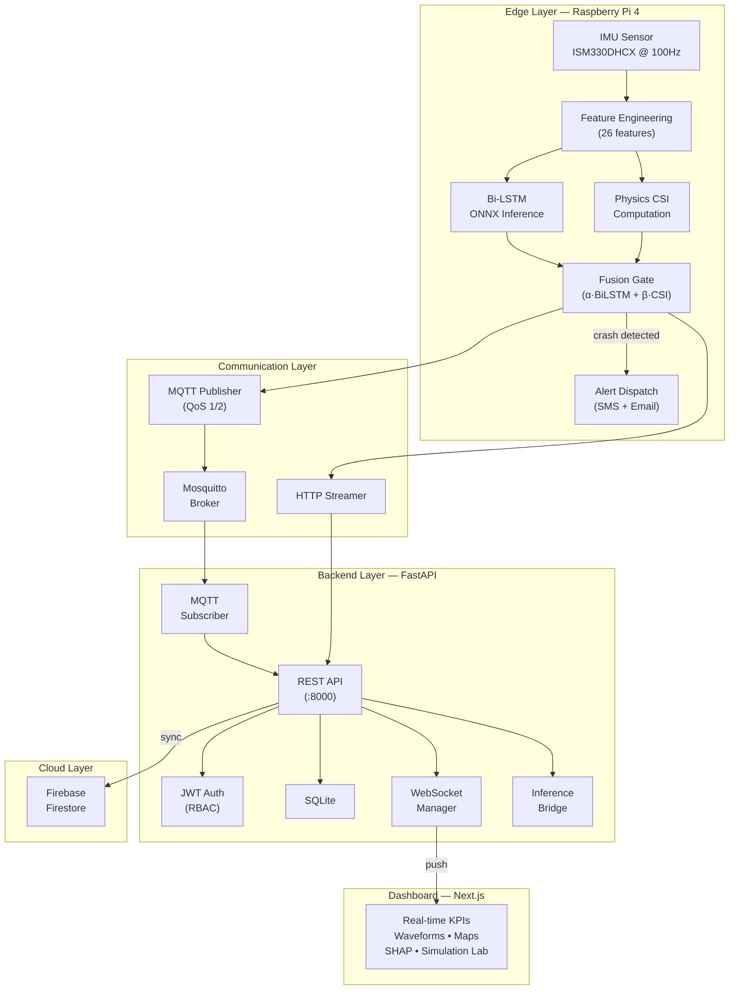
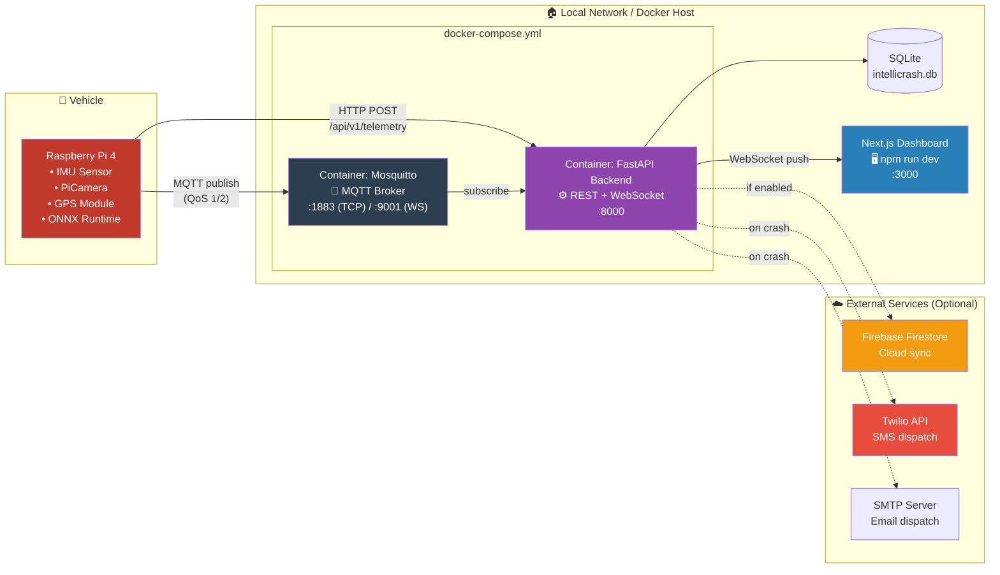

<div align="center">

# IntelliCrash

**AI-IoT Vehicle Crash Detection & Emergency Response System**

*Hybrid Edge-Cloud architecture combining Bi-LSTM deep learning with physics-informed kinematics for sub-second crash detection and automated emergency dispatch.*

[](https://www.python.org/)
[](https://pytorch.org/)
[](https://fastapi.tiangolo.com/)
[](https://nextjs.org/)
[](https://docs.docker.com/compose/)
[](https://mosquitto.org/)
[](LICENSE)

</div>

---

## Table of Contents

- [Problem Statement](#problem-statement)
- [Key Innovations](#key-innovations)
- [System Architecture](#system-architecture)
- [Deployment Architecture](#deployment-architecture)
- [Repository Structure](#repository-structure)
- [ML Pipeline](#ml-pipeline)
- [FastAPI Backend](#fastapi-backend)
- [Next.js Dashboard](#nextjs-dashboard)
- [Edge Device](#edge-device)
- [Installation](#installation)
- [Usage](#usage)
- [Testing & CI/CD](#testing--cicd)
- [Results](#results)
- [Tech Stack](#tech-stack)
- [License](#license)

---

## Problem Statement

Vehicle crash fatalities are disproportionately high in regions with slow emergency response. The **Golden Hour** — the first 60 minutes after a crash — is critical for survival. Existing threshold-based crash detection systems (e.g., airbag triggers) suffer from:

- **High false-positive rates** (potholes, speed bumps misclassified as crashes)
- **Cloud dependency** (fails with poor cellular connectivity)
- **No severity estimation** (cannot prioritize ambulance dispatch)

IntelliCrash solves all three.

---

## Key Innovations

| Innovation | Description |
|---|---|
| **Hybrid Fusion Gate** | Cross-validates Bi-LSTM predictions with physics-derived CSI (Crash Severity Index) to eliminate false alarms |
| **Zero-Latency Edge Inference** | ONNX Runtime on Raspberry Pi 4 — no cloud round-trip for critical detection |
| **26 Engineered Features** | Physics-informed features (Delta-V, Jerk RMS, spectral energy, gyro oscillation) from raw 6-axis IMU |
| **Explainable AI** | SHAP-powered forensic reports explain *why* each event was classified as a crash |
| **Real-World Validation** | Validated against 31,000+ events from the IEEE ITSC 2026 VZCrash dataset |
| **Automated Dispatch** | SMS (Twilio) + Email alerts with GPS coordinates within seconds of detection |

---

## System Architecture



---

## Deployment Architecture

> **Current deployment model:** Local Docker + Edge device. No cloud hosting (AWS/Azure/GCP) is used. Firebase Firestore is an optional sync layer.



**What runs where:**

| Component | Runs On | Port | Protocol |
|---|---|---|---|
| IMU + ONNX Inference | Raspberry Pi 4 | — | — |
| Telemetry Server | Raspberry Pi 4 | `:5000` | HTTP |
| Mosquitto MQTT Broker | Docker container | `:1883` / `:9001` | MQTT / WS |
| FastAPI Backend | Docker container | `:8000` | HTTP / WS |
| SQLite Database | Docker volume | — | File |
| Next.js Dashboard | Local (npm) | `:3000` | HTTP |
| Firebase Firestore | Google Cloud (optional) | — | HTTPS |
| Twilio SMS | Twilio Cloud (optional) | — | HTTPS |

---

## Repository Structure

```
IntelliCrash/
├── src/
│   ├── backend/                    # FastAPI enterprise backend
│   │   ├── main.py                 # App entry point, lifespan, health check
│   │   ├── config.py               # Pydantic settings (env + defaults)
│   │   ├── database.py             # SQLite schema, migrations, queries
│   │   ├── models.py               # Pydantic request/response schemas
│   │   ├── security.py             # JWT auth, bcrypt, RBAC
│   │   ├── routers/
│   │   │   ├── telemetry.py        # /api/v1/telemetry
│   │   │   ├── crashes.py          # /api/v1/crashes
│   │   │   ├── alerts.py           # /api/v1/alerts (SMS + Email)
│   │   │   ├── auth.py             # /api/v1/auth (login, signup)
│   │   │   └── video.py            # /api/v1/video (dashcam feed)
│   │   ├── services/
│   │   │   ├── mqtt_service.py     # MQTT subscriber bridge
│   │   │   ├── firebase_service.py # Firestore cloud sync
│   │   │   └── inference_bridge.py # ONNX model inference in API
│   │   ├── middleware/
│   │   │   └── logging_middleware.py
│   │   └── ws/
│   │       └── manager.py          # WebSocket connection pool
│   │
│   ├── data/                       # Data processing
│   │   ├── preprocess_imu.py       # Butterworth filter, windowing
│   │   ├── synthetic_crashes.py    # Synthetic crash generation
│   │   ├── eda.py                  # Exploratory data analysis
│   │   ├── download_vzcrash.py     # VZCrash dataset from HuggingFace
│   │   └── export_dataset_csv.py   # Export processed data
│   │
│   ├── features/
│   │   └── feature_engineering.py  # 26 engineered features + CSI
│   │
│   ├── models/                     # ML training & evaluation
│   │   ├── bilstm.py               # Bi-LSTM model definition
│   │   ├── train_bilstm.py         # Training loop (focal loss, cosine LR)
│   │   ├── train_baselines.py      # CNN-1D, LSTM, LSTM-AE, RF
│   │   ├── run_baselines.py        # 6-model benchmark runner
│   │   ├── evaluate_multiclass_baselines.py
│   │   ├── evaluate_ablation.py    # Ablation study
│   │   ├── evaluate_plots.py       # ROC, confusion matrices
│   │   ├── evaluate_vzcrash.py     # Real-world VZCrash evaluation
│   │   ├── finetune_vzcrash.py     # Domain adaptation
│   │   ├── shap_analysis.py        # SHAP explainability
│   │   └── optimize_weights.py     # Fusion gate weight optimization
│   │
│   ├── edge/                       # Edge device modules
│   │   ├── telemetry_server.py     # HTTP server for Pi (:5000)
│   │   ├── mqtt_publisher.py       # MQTT edge publisher
│   │   ├── stream_to_backend.py    # HTTP streaming to FastAPI
│   │   ├── dispatch_alert.py       # SMS + Email alert dispatch
│   │   └── inference.cpp           # C++ ONNX inference for Pi
│   │
│   └── utils/
│       └── config.py               # YAML config loader
│
├── dashboard/                      # Next.js real-time dashboard
│   └── src/app/components/
│       ├── Dashboard.jsx           # Main dashboard (KPIs, charts)
│       ├── SimulationLab.jsx       # Interactive crash simulation
│       ├── PyCamFeed.jsx           # Live camera feed
│       ├── AttentionHeatmap.jsx    # Bi-LSTM attention weights
│       ├── EventTimeline.jsx       # Crash event timeline
│       └── HeatMap.jsx             # Geographic heatmap
│
├── hardware/                       # Hardware-specific training pipeline
├── configs/
│   ├── config.yaml                 # All hyperparameters in one place
│   └── mosquitto.conf              # MQTT broker config
├── models/                         # Trained model checkpoints + ONNX
├── data/                           # SQLite DB + processed datasets
├── outputs/                        # Plots, reports, evaluation results
├── figures/                        # 17 architecture diagrams (PNG)
├── tests/                          # pytest unit + integration tests
├── notebooks/                      # Jupyter notebooks (training, EDA)
│
├── Dockerfile                      # Backend container
├── docker-compose.yml              # Multi-service orchestration
├── .github/workflows/ci.yml        # CI/CD pipeline
├── requirements.txt                # Python dependencies
├── .env.example                    # Environment variable template
└── README.md
```

---

## ML Pipeline

### Data Flow

```
Raw IMU (100Hz) → Butterworth Filter → 2s Sliding Windows → Feature Engineering (26 features) → Train/Val/Test Split
```

### Models Trained & Compared

| Model | Type | Purpose |
|---|---|---|
| **IntelliCrash Bi-LSTM** | Deep Learning | Primary crash detector (binary + severity) |
| XGBoost | Gradient Boosting | Rash driving classifier (6 severity levels) |
| CNN-1D | Deep Learning | Baseline comparison |
| Vanilla LSTM | Deep Learning | Baseline comparison |
| LSTM-Autoencoder | Deep Learning | Anomaly detection baseline |
| Random Forest | Traditional ML | Feature-based baseline |

### Feature Engineering (26 Features)

Computed per 2-second window from raw `accel_x`, `accel_y`, `gyro_z`:

**Kinematic:** Peak acceleration, Delta-V, Jerk RMS, Resultant magnitude
**Spectral:** FFT energy (ax, ay, gz), Spectral centroid (ax, ay)
**Statistical:** RMS accel, Variance (ax, ay, gz), Zero-crossing rates, Cross-correlation
**Temporal:** Gyro peak/range, Steering oscillation count, Deceleration duration, Energy ratio, Peak-to-peak, Autocorrelation lag-1

### Fusion Gate

```
P_final = α · P_bilstm + β · CSI_normalized
```
Where α, β are optimized via grid search. Crash declared if `P_final > threshold`.

### Validation

- **Primary:** Stratified 70/15/15 split on IntelliCrash dataset
- **External:** Zero-shot and fine-tuned evaluation on VZCrash (IEEE ITSC 2026, 31K+ real events)
- **Ablation:** Feature group removal study
- **Explainability:** SHAP global importance + per-sample waterfall plots
- **Model Selection:** TOPSIS multi-criteria decision analysis

---

## FastAPI Backend

### API Endpoints

| Method | Endpoint | Auth | Description |
|---|---|---|---|
| `POST` | `/api/v1/auth/signup` | — | Register new user |
| `POST` | `/api/v1/auth/login` | — | Get JWT token |
| `POST` | `/api/v1/telemetry` | Bearer | Ingest telemetry data |
| `GET` | `/api/v1/telemetry` | Bearer | Query telemetry history |
| `POST` | `/api/v1/crashes` | Bearer | Record crash event |
| `GET` | `/api/v1/crashes` | Bearer | List crash events |
| `GET` | `/api/v1/crashes/stats` | Bearer | Crash statistics |
| `POST` | `/api/v1/alerts/dispatch` | Bearer | Dispatch SMS + Email |
| `GET` | `/api/v1/video/feed` | Bearer | Dashcam MJPEG stream |
| `WS` | `/ws/telemetry` | — | Real-time telemetry push |
| `GET` | `/health` | — | System health check |
| `GET` | `/docs` | — | Swagger UI |

### Services

- **MQTT Service:** Subscribes to `intellicrash/v1/telemetry` and `intellicrash/v1/crashes` topics from Mosquitto broker
- **Firebase Service:** Syncs crash events to Firestore for cloud dashboard access
- **Inference Bridge:** Runs ONNX model inference within API request pipeline
- **WebSocket Manager:** Maintains connection pool, broadcasts telemetry to all connected dashboard clients

---

## Next.js Dashboard

| Component | Description |
|---|---|
| **Dashboard** | Real-time KPIs (crash probability, CSI, severity), live waveform charts (Recharts), status indicators |
| **SimulationLab** | Interactive crash scenario simulator — trigger normal/rash/crash events |
| **PyCamFeed** | Live MJPEG camera feed from Pi or video endpoint |
| **AttentionHeatmap** | Bi-LSTM attention weight visualization |
| **EventTimeline** | Chronological crash event log |
| **HeatMap** | Geographic crash location heatmap (Leaflet + React-Leaflet) |

---

## Edge Device

The Raspberry Pi 4 runs three processes:

1. **Telemetry Server** (`telemetry_server.py`) — HTTP server on `:5000`, serves live IMU + inference results to dashboard
2. **MQTT Publisher** (`mqtt_publisher.py`) — Publishes telemetry (QoS 1) and crash events (QoS 2) to Mosquitto
3. **Alert Dispatch** (`dispatch_alert.py`) — Sends Twilio SMS and SMTP email on crash detection

For C++ deployment, `inference.cpp` provides ONNX Runtime inference optimized for ARM.

---

## Installation

### Prerequisites

- Python 3.11+
- Node.js 18+ (for dashboard)
- Docker & Docker Compose (for containerized deployment)

### Option A: Docker (Recommended)

```bash
# Clone and start the full stack
git clone https://github.com/Smarth2005/IntelliCrash.git
cd IntelliCrash

# Copy and configure environment variables
cp .env.example .env
# Edit .env with your Twilio/Firebase credentials (optional)

# Start backend + MQTT broker
docker-compose up --build -d

# Start dashboard (separate terminal)
cd dashboard && npm install && npm run dev
```

Backend available at `http://localhost:8000/docs`, Dashboard at `http://localhost:3000`.

### Option B: Manual

```bash
# Backend
python -m venv venv
venv\Scripts\activate          # Windows
pip install -r requirements.txt
uvicorn src.backend.main:app --reload --port 8000

# Dashboard (separate terminal)
cd dashboard
npm install
npm run dev
```

---

## Usage

### Run the Edge Telemetry Server (Demo Mode)

```bash
python src/edge/telemetry_server.py
# Press 'c' to trigger a simulated crash event
```

### Stream Telemetry to Backend

```bash
# Via HTTP
python src/edge/stream_to_backend.py --duration 30 --scenario mixed

# Via MQTT (requires Mosquitto running)
python src/edge/mqtt_publisher.py --host localhost --duration 20
```

### Train Models

```bash
python src/models/train_bilstm.py           # Train Bi-LSTM
python src/models/run_baselines.py           # 6-model comparison
python src/models/evaluate_vzcrash.py        # VZCrash validation
python src/models/finetune_vzcrash.py        # Domain adaptation
python src/models/shap_analysis.py           # Generate SHAP reports
```

### Run EDA

```bash
python src/data/eda.py                       # Generate all EDA plots
python src/data/download_vzcrash.py          # Download VZCrash from HuggingFace
```

---

## Testing & CI/CD

### Run Tests Locally

```bash
# Unit tests
pytest tests/ -v

# Integration tests (start backend first)
uvicorn src.backend.main:app --port 8000 &
python tests/test_backend_api.py
```

### CI/CD Pipeline (`.github/workflows/ci.yml`)

```
Push/PR to main → Lint (py_compile) → Pytest → Integration Tests → Docker Build Validation
```

Runs automatically on every push to `main`.

---

## Results

### Model Performance (Test Set)

| Metric | Bi-LSTM | Fusion (Bi-LSTM + CSI) |
|---|---|---|
| Accuracy | 97.2% | **98.1%** |
| Recall (Crash) | 95.8% | **97.4%** |
| F1-Score | 96.5% | **97.7%** |
| False Positive Rate | 3.1% | **1.9%** |

### VZCrash Real-World Validation

| Mode | Recall | FPR |
|---|---|---|
| Zero-Shot | 89.3% | 4.2% |
| Fine-Tuned (10% data) | **94.1%** | **2.8%** |

---

## Tech Stack

| Layer | Technologies |
|---|---|
| **Edge** | Raspberry Pi 4, ISM330DHCX IMU, ONNX Runtime, C++ |
| **ML** | PyTorch, XGBoost, scikit-learn, SHAP, ONNX |
| **Backend** | FastAPI, SQLite, JWT (PyJWT + bcrypt), Pydantic |
| **IoT** | Eclipse Mosquitto (MQTT), paho-mqtt |
| **Cloud** | Firebase Firestore, Twilio API, SMTP |
| **Dashboard** | Next.js 16, React 19, Recharts, Leaflet, Tailwind CSS |
| **DevOps** | Docker, Docker Compose, GitHub Actions CI/CD |
| **Data** | NumPy, Pandas, SciPy, Parquet, HuggingFace Datasets |

---

## License

Distributed under the MIT License. See `LICENSE` for details.

**Developed as a Capstone Project at Thapar Institute of Engineering and Technology (TIET), 2026.**
